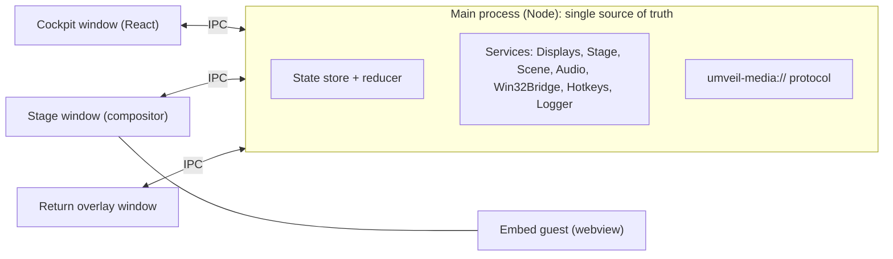
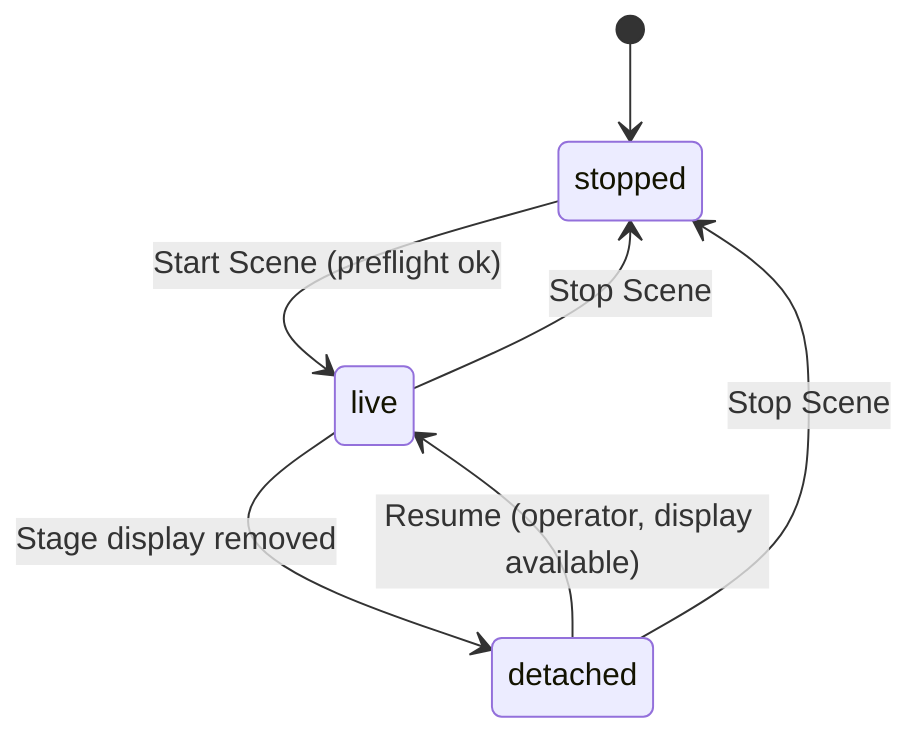
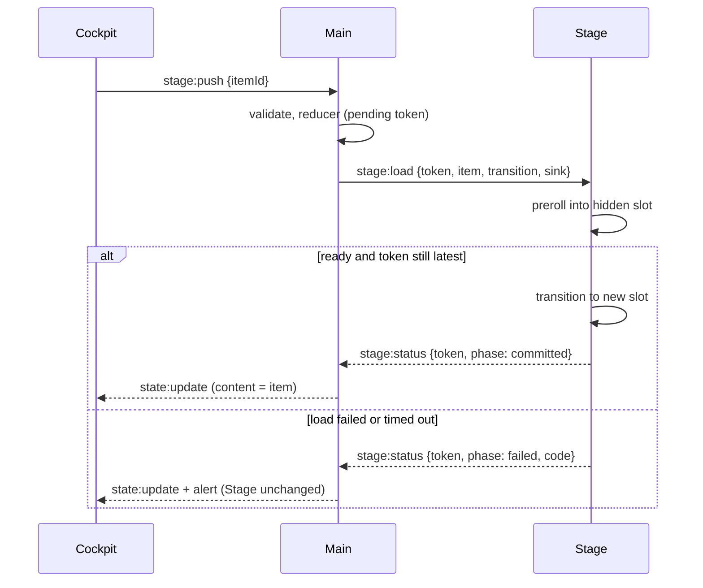
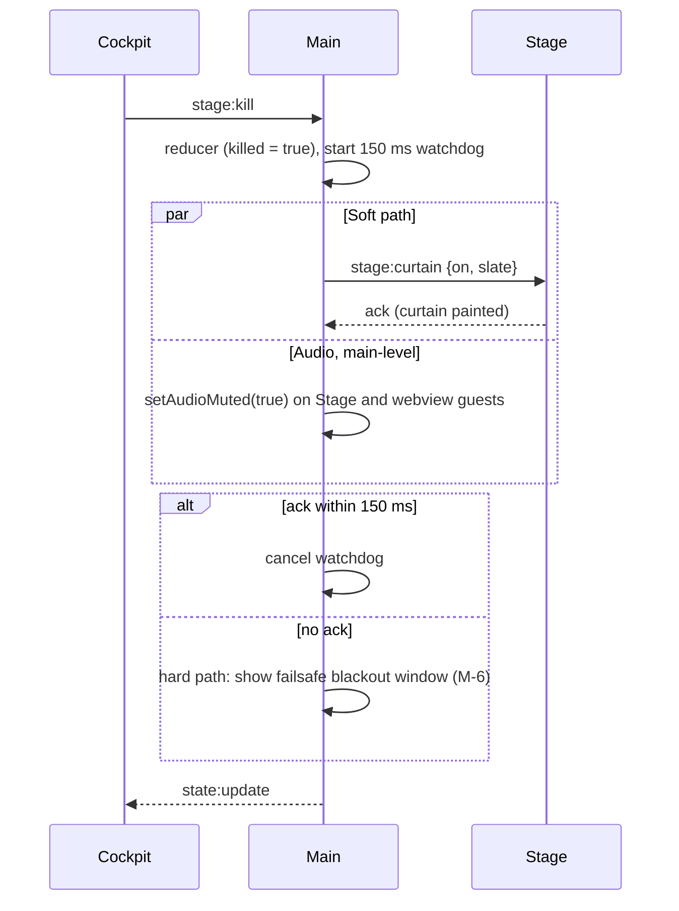
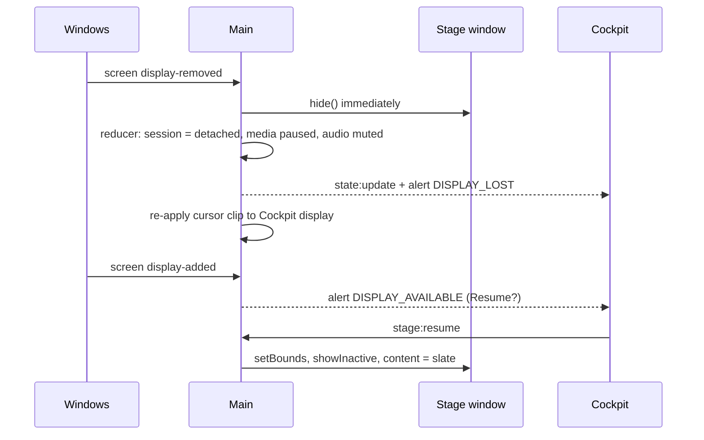
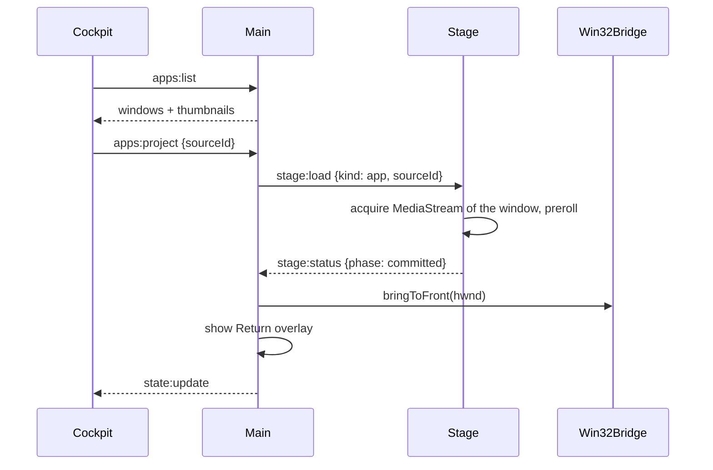

# Architecture: umveil

Companion to `PRD.md` (what) and `DECISIONS.md` (why). Items marked **[spike S-n]** are design assumptions that must be validated in `ROADMAP.md` §1 before depending on them.

## 1. Constraints that shape the design

1. Operator and audience surfaces must be separate OS windows on separate displays (INV-1, INV-2).
2. Every failure path must end in a safe state. The design therefore centralizes state in one process and keeps the Stage "dumb" (INV-5).
3. Stage output must be capturable (confidence monitor, freeze), so the Stage window must not use content protection.
4. Windows-only v1 lets us use Win32 for the few things Electron lacks (cursor confinement, window-to-process mapping, foreground control).

## 2. Process and window model



| Window | Created | Properties |
|---|---|---|
| **Cockpit** | At launch | Normal framed window on the laptop display. Hosts the React UI. |
| **Stage** | On Start Scene (hidden until positioned) | Frameless, `focusable: false`, `skipTaskbar`, always-on-top at `screen-saver` level, bounds = target display bounds (not OS fullscreen), black background, cursor hidden, **no content protection**. Shown with `showInactive()`. Hosts the compositor. |
| **Return overlay** | While an app is mirrored | Small frameless always-on-top window clamped to the Cockpit's display; `setContentProtection(true)` so OS display affinity excludes it from every capture (belt and braces for INV-2). |
| **Failsafe blackout** (M-6) | On Start Scene, hidden | Pure black frameless window over the Stage display, no content; shown by the hard-kill path. Needs no renderer logic to paint black. |

Webview guests (embeds) are separate renderer processes hosted inside the Stage window.

Rationale for frameless-at-bounds instead of OS fullscreen: OS fullscreen on Windows can resize, flash, or relocate across multi-monitor setups **[spike S-4]**.

## 3. Main-process services

| Service | Responsibility |
|---|---|
| `Store` | Holds `AppState` (see `IPC_CONTRACT.md`), applies pure reducer actions, bumps `revision`, broadcasts snapshots. The reducer lives in `src/shared` and is unit-tested. |
| `DisplayService` | Wraps Electron `screen`: lists displays, picks the Stage display, listens to `display-added`, `display-removed`, `display-metrics-changed`; detects mirror/duplicate mode (fewer than two displays); emits typed events. |
| `StageController` | Creates, positions, shows, hides, reloads the Stage window; sends render commands; owns the hard-kill watchdog; mutes audio at the WebContents level. |
| `SceneService` | New/open/save/autosave of `.umveil`; asset import (hash, probe, copy to scene cache); zip-slip-safe extraction (`SCENE_FORMAT.md`). |
| `MediaProtocol` | Registers `umveil-media://asset/<assetId>` serving files from the scene cache with Range support **[spike S-5]**. |
| `AudioService` | Tracks the selected output and its availability; applies INV-4 policy (mute when unavailable); test tone. |
| `CaptureService` | Lists windows (`desktopCapturer`), exposes the Stage's media source id for the confidence monitor, performs the freeze capture. |
| `Win32Bridge` | The only module that touches Win32 (via `koffi`): `clipCursor`, `hwndFromSourceId`, `getWindowInfo`, `bringToFront`. |
| `Hotkeys` | `globalShortcut` registration for Kill/Freeze/Return. |
| `Logger` | JSON-lines logging with rotation. |
| `PowerService` | `powerSaveBlocker('prevent-display-sleep')` while live; handles `suspend`/`resume`. |

`Win32Bridge` interface (all coordinates physical pixels; convert from DIPs with `screen.dipToScreenRect`):

```ts
interface Win32Bridge {
  clipCursor(rect: PhysicalRect | null): void;            // null releases
  hwndFromSourceId(sourceId: string): bigint | null;      // parses "window:<HWND>:0" (format confirmed in S-1)
  getWindowInfo(hwnd: bigint): { processName: string; title: string; minimized: boolean } | null;
  bringToFront(hwnd: bigint): boolean;
}
```

## 4. State model

The complete typed model is in `IPC_CONTRACT.md`. Key points:

- **Stage session** is a three-state machine; **kill** and **freeze** are independent flags on top of it.



- **Content** is a discriminated union: `slate | image | video | embed | app`.
- **Pending push**: `{ token, itemId }` while the Stage is prerolling (INV-6).
- High-frequency data (video position) is **not** in the snapshot; it travels on a separate `playback:tick` channel.
- Snapshots are whole-state with a monotonically increasing `revision`; clients drop stale revisions.

Effective visual precedence on the Stage, top to bottom: **Curtain (killed) > Freeze image > Content**. Detached means the Stage window is hidden entirely.

## 5. Stage compositor

```text
Stage window (black, cursor: none)
└─ #root
   ├─ .canvas   16:9, centered, width = min(100vw, 100vh * 16/9)
   │   ├─ .layer-A   content slot A
   │   └─ .layer-B   content slot B   (one visible, the other prerolling)
   ├─ .freeze   full-window  of the frozen frame (hidden unless frozen)
   └─ .curtain  full-window black, or logo centered inside a 16:9 region (hidden unless killed)
```

- **Letterbox (FR-11):** `.canvas` is a 16:9 box fitted inside the display; bars are the black background around it. Media uses `object-fit: contain`. Embeds and mirrors render at the canvas's CSS pixel size (no CSS transform scaling, so text stays crisp).
- **A/B slots:** a push loads into the hidden slot. Only when the slot reports ready (image decoded, video `canplay` with first frame, webview `did-finish-load`, mirror first frame) does the compositor transition (opacity cut/crossfade). A later token supersedes an earlier one; superseded loads are discarded.
- **Layer content types:** ``, `<video src="umveil-media://...">`, `<webview partition="persist:umveil-embeds">`, `<video>` fed by a `MediaStream` for app mirrors.
- **Curtain and freeze live outside `.canvas`** so they cover the whole window including bars. The curtain is plain DOM, so it cannot be covered by embeds (this is why embeds use `<webview>`, a DOM element, not a native `WebContentsView`; see ADR-008).
- **Reload recovery:** after any Stage reload/crash the main process sends `stage:sync` with the full desired state so the compositor rebuilds.

## 6. Key flows

### 6.1 Push an item (preroll gate, INV-6)



### 6.2 Kill (two-tier, ADR-007)



### 6.3 Display removed (FR-06)



### 6.4 Mirror an app (FR-12/13)



## 7. Display management

- **Cockpit display** = the display containing the Cockpit window. **Stage display** = operator choice, defaulting to a non-internal display other than the Cockpit's, else the first non-Cockpit display.
- The Stage is positioned by creating it with the target display's origin, then applying `setBounds` after show and verifying; re-apply on `display-metrics-changed` (projectors renegotiate resolution; mixed-DPI setups can drift bounds) **[spike S-4]**.
- **Duplicate/mirror mode** shows up as a single logical display: Start is blocked (FR-04) and, if it happens while live, it is treated as removal (FR-06).
- **Sleep/resume:** on `resume`, re-evaluate displays, re-apply cursor clip, never auto-resume playback.
- Persisted display hint (size, internal flag) is only a soft preference; Electron display ids are not stable across sessions.

## 8. Audio architecture

- **Video played by umveil:** each `<video>` in the Stage calls `setSinkId(deviceId)` before play; if it fails or the device is missing, the element is muted (INV-4). The Stage listens to `devicechange` and reports to main, which updates `AudioState`.
- **Kill:** muting is done in the main process via `setAudioMuted(true)` on the Stage's WebContents and on every webview guest (found through `hostWebContents`), so it works even if the Stage renderer is hung. It is also applied in the renderer (pause + `muted`).
- **Embeds (best effort) [spike S-3]:** webview guest audio does not follow the Stage's sink automatically. Plan: a guest preload injects a main-world script (`webFrame.executeJavaScript`) that calls `setSinkId` on media elements as they play and on `AudioContext`. Fallback: documented Windows per-app output setting for `umveil.exe`.
- **App mirrors:** not managed in v1 (PRD §5 guarantee table).
- **Device enumeration [spike S-3]:** confirm that labels are available for output devices in Electron; if not, grant a transient `media` permission and stop the stream immediately, or enumerate through Win32 (MMDevice) via the bridge.
- **Crossfade:** managed audio crossfades by animating element volume over the transition duration.

## 9. Capture architecture

Two distinct uses, one mechanism (`MediaStream` from a desktop source):

| Use | Source | Consumer |
|---|---|---|
| App mirror (FR-12) | External window selected from `desktopCapturer.getSources({ types: ['window'] })` | `<video>` layer in the Stage |
| Confidence monitor (FR-14) | The Stage window, via `stageWindow.getMediaSourceId()` | `<video>` in the Cockpit, muted, constrained to ~15 fps and reduced size **[spike S-2]** |

Notes:
- umveil's own Cockpit/Stage/Overlay windows are filtered out of the app list (prevents recursion).
- The stream is acquired in the renderer with the desktop-source constraint, or through `session.setDisplayMediaRequestHandler`; pick one in S-1 and keep it.
- Freeze uses `stageWindow.webContents.capturePage()` in main, then sends a JPEG data URL to the Stage's `.freeze` layer. Verify that webview content is included **[spike S-2]**.
- Fallback for the confidence monitor if stream capture misbehaves: poll `capturePage()` at ~5 fps.
- Known limits: DRM content is black; elevated (admin) windows may not be capturable from a non-elevated umveil (UIPI); minimized windows produce no frames (handled by FR-12's alert and slate fallback).

## 10. Cursor lock

`Win32Bridge.clipCursor` confines the pointer to the Cockpit display's physical-pixel rectangle. Re-applied on display changes and resume; released on toggle-off, Stop Scene, `before-quit`, `will-quit`, and uncaught-exception handlers (INV-8). Whether Windows releases the clip if the process dies is verified in **[spike S-4]**; the hardening task (M-6) adds a startup self-release.

## 11. Security

- All windows: `contextIsolation: true`, `sandbox: true`, `nodeIntegration: false`; preloads expose a minimal typed API via `contextBridge`.
- IPC: every channel validated with zod; handlers verify the sender's `webContents` belongs to the expected window; reject unknown channels.
- Embeds: dedicated partition `persist:umveil-embeds` (persistent so operator logins survive); `allowpopups` off; `setWindowOpenHandler` denies; permission request/check handlers deny everything; navigation limited to http(s); guest preload exposes no IPC.
- Media is served only through `umveil-media://asset/<assetId>` mapping to known cached files; no path parameters from renderers.
- Scene files are data: extraction accepts only `media/<sha256>.<ext>` entries (zip-slip safe); app targets never launch processes.
- DevTools disabled in production builds. Single-instance lock (`requestSingleInstanceLock`); a second launch with a `.umveil` path forwards it to the first.

## 12. Failure handling matrix

| Failure | Detection | Required behavior |
|---|---|---|
| Stage display removed / mirror mode | `display-removed`, display count < 2 | Hide Stage, pause, mute, banner, no auto-resume (FR-06) |
| Projector changes resolution | `display-metrics-changed` | Re-apply bounds and cursor clip; compositor refits |
| Selected audio device lost | Stage `devicechange` | Mute managed audio, alert (INV-4) |
| Stage renderer hung | Kill watchdog (150 ms) | Hard kill path (blackout window + mute) |
| Stage renderer crashed | `render-process-gone` | Show blackout, reload Stage, `stage:sync`; remain killed until operator Restore |
| Cockpit renderer crashed | `render-process-gone` | Reload Cockpit, rehydrate from main snapshot; Stage unaffected |
| Embed load error/timeout (8 s) | `did-fail-load`, timer | Stage unchanged; Cockpit error on tile |
| Media decode error on push | `<video>`/`` error | Stage unchanged; tile error. Mid-playback: pause and alert |
| Mirrored window closed/minimized | Track `ended`; 500 ms Win32 poll while mirroring | Stage to slate, alert |
| Scene file corrupt or too new | Schema validation | Error dialog, state unchanged |
| Hotkey already taken | `globalShortcut.register` returns false | Alert; button still works |
| System sleep/resume | `powerMonitor` events | Re-evaluate displays, re-clip cursor, remain paused |
| **Main process crash (residual risk)** | n/a | Stage disappears and the projector shows the desktop. Mitigation: operator sets a solid black wallpaper on the projector display; optional external watchdog is P2 (R-09) |

## 13. Repository layout

```text
umveil/
├─ package.json
├─ electron.vite.config.ts
├─ tsconfig.json  (+ node / web variants)
├─ README.md  CLAUDE.md
├─ docs/
├─ spikes/                 # throwaway experiments (S-1..S-6)
├─ test/                   # e2e + fixtures
└─ src/
   ├─ shared/              # no Electron imports
   │   ├─ ipc.ts           # channel names + payload types (zod schemas)
   │   ├─ state.ts         # AppState types + reducer
   │   ├─ scene-schema.ts  # .umveil schema (zod) + migrations
   │   └─ url.ts           # embed URL validation/normalization
   ├─ main/
   │   ├─ index.ts
   │   ├─ store.ts
   │   ├─ ipc-router.ts
   │   └─ services/ displays.ts stage.ts scene.ts media-protocol.ts
   │                audio.ts capture.ts win32.ts hotkeys.ts power.ts logger.ts
   ├─ preload/             # cockpit.ts stage.ts overlay.ts embed-guest.ts
   └─ renderer/
       ├─ cockpit/         # React app
       ├─ stage/           # vanilla TS compositor
       └─ overlay/         # tiny vanilla page
```

Build: `electron-vite` with three renderer entry pages (cockpit, stage, overlay). Packaging: `electron-builder` with `portable` and `nsis` targets. Pin the exact Electron version in `package.json` at project start (use the latest stable then) and upgrade deliberately.

## 14. Observability

`Logger` writes JSON lines (`ts`, `level`, `event`, `data`). Always logged: scene open/save, Start/Stop, every push (item id, kind), Kill/Restore with measured latency, Freeze, display and audio events, hotkey registration, alerts, crashes. Never logged: file contents, full URLs with query strings.
